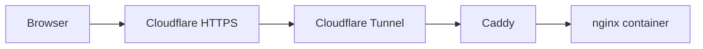

# Hi, I'm Javier Marfil

**DevOps Engineer based in Barcelona.** I work on reproducible infrastructure, delivery automation and the tools engineering teams use to build and release software.

[Portfolio & CVs (EN / ES)](https://portfolio.jmarfil.com/) | [LinkedIn](https://www.linkedin.com/in/javier-marfil/)

## What I work on

- **Infrastructure as code:** Terraform and Terragrunt across AWS and vSphere, including remote-state migrations and blue/green infrastructure updates.
- **Build platforms:** Windows and Linux self-hosted GitHub Actions runners, with Ansible and Packer for provisioning.
- **CI/CD and repository migrations:** GitHub Actions and Jenkins, including migrations from GitLab and Azure DevOps to GitHub.
- **Controlled releases:** Container deployment pipelines, OIDC authentication, environment promotion, smoke tests and rollback.

My background in test automation and internal application development helps me connect infrastructure, developer needs and release validation.

## Selected projects

### MyFitHub

A complete, self-hosted health and fitness application for nutrition tracking, guided workouts and progress monitoring. Built with **React, FastAPI and PostgreSQL**, and deployed with **Docker** on my own infrastructure.

[Visit MyFitHub](https://myfithub.jmarfil.com/) | [Project overview](https://portfolio.jmarfil.com/#projects)

**Access:** Personal proof of concept. Google sign-in is limited to approved accounts; this is not an unrestricted public demo.

### Self-hosted portfolio

My bilingual [DevOps portfolio](https://portfolio.jmarfil.com/), with selected projects, practical capabilities, professional experience and downloadable CVs in English and Spanish.

Built with **React, Vite and Tailwind CSS**, prerendered for search engines, and served from an **nginx container** using **Docker Compose, Caddy and Cloudflare Tunnel** rather than GitHub Pages.

Public request path

### Open-source tooling

- **[PipeForge](https://github.com/Marfoil/pipeForge):** A reusable **Jenkins shared library** with CI/CD building blocks for Docker, Git, SonarQube, Artifactory, notifications and test execution. [Documentation](https://marfoil.github.io/pipeForge/)
- **[Java Selenium Framework](https://github.com/Marfoil/JavaSeleniumFramework):** A Java test automation template with Selenium, Cucumber and TestNG, including parallel execution and Allure reporting. [Documentation](https://marfoil.github.io/JavaSeleniumFramework/)

## Tools I use

**Infrastructure & delivery:** Terraform, Terragrunt, Ansible, Packer, AWS, vSphere, GitHub Actions, Jenkins, Docker and Docker Compose.

**Development & automation:** Python, Bash, PowerShell, JavaScript, React, FastAPI, PostgreSQL, Java and Groovy.

## Get in touch

[Portfolio](https://portfolio.jmarfil.com/) | [LinkedIn](https://www.linkedin.com/in/javier-marfil/) | [Email](mailto:xavimarfil@gmail.com)
